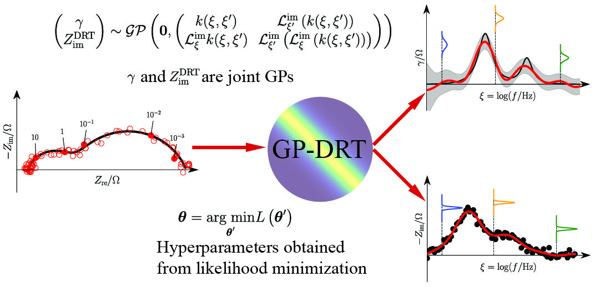

# Project
GP-DRT: Gaussian Process Distribution of Relaxation Times

This repository contains some of the source code used for the paper entitled
"The Gaussian Process Distribution of Relaxation Times: A Machine Learning Tool for the Analysis and Prediction of Electrochemical Impedance Spectroscopy Data" 
<u>https://doi.org/10.1016/j.electacta.2019.135316</u>, the preprint is also available in the [docs](docs) folder.


# Introduction
The distribution of relaxation times (DRT) [1] is an elegant approach for the analysis of electrochemical impedance spectroscopy (EIS) data encountered in materials science, electrochemistry, and other fields. However, deconvolving the DRT from EIS data is an ill-posed problem [2-3], which is particularly sensitive to experimental errors. Several well-known approaches [2-5] can overcome this issue, but they all require the use of ad hoc hyperparameters. Furthermore, most methods are not probabilistic and therefore, do not provide any insight into uncertainty regarding the estimated DRT. GP-DRT [6] is our newly developed approach that can obtain both the DRT mean and covariance from the EIS data. It can also predict the DRT and the imaginary part of the impedance at frequencies that were not previously measured. One crucial point of the GP-DRT method is that the parameters that define the GP-DRT model can be selected rationally by maximizing the experimental evidence. The GP-DRT approach was tested against both synthetic experiments and “real” experiments. We found that the GP-DRT can manage considerable noise, overlapping timescales, truncated data, and inductive features.


<div align='center'><strong>Figure 1. Schematic illustration of the GP-DRT method.</strong></div>

# Dependencies
`numpy`

`scipy`
 
`matplotlib`

`pandas`

# Tutorials

* **ex1_single_ZARC.ipynb**: this notebook shows how one can recover the DRT from impedance synthesized using a single ZARC element consisting of a resistance placed in parallel to a constant phase element (CPE). 
The frequency range is from 1E-4 Hz to 1E4 Hz with 10 points per decade (ppd).

* **ex2_double_ZARC.ipynb**: this notebook shows how the GP-DRT model can manage overlapping timescales from two ZARC elements in series. 
The frequency range is from 1E-4 Hz to 1E4 Hz with 10 ppd.

* **ex3_truncated_ZARC.ipynb**: this notebook shows how the GP-DRT model can 
1) recover the DRT from atruncated EIS spectrum (data points at lower frequencies, i.e., f < 1E-3 Hz, are not available), and 
2) predict the impedance value at these frequencies.

* **ex4_experiment.ipynb**: shows an example using experimental EIS data. In this tutorial, the EIS data is read from acsv file and the DRT is predicted by the GP-DRT model.

* **ex5_inductance_plus_ZARC.ipynb**: this notebook adds an inductance to the model used in ex1_single_ZARC.ipynb

# Citation

```
@article{liu2019gaussian,
  title={The Gaussian process distribution of relaxation times: A machine learning tool for the analysis and prediction of electrochemical impedance spectroscopy data},
  author={Liu, Jiapeng and Ciucci, Francesco},
  journal={Electrochimica Acta},
  pages={135316},
  year={2019},
  publisher={Elsevier}
}
```

# References
1. Ciucci, F. (2018). Modeling electrochemical impedance spectroscopy. Current Opinion in Electrochemistry.132-139 [doi.org/10.1016/j.coelec.2018.12.003](https://doi.org/10.1016/j.coelec.2018.12.003)
2. Wan, T. H., Saccoccio, M., Chen, C., & Ciucci, F. (2015). Influence of the discretization methods on the distribution of relaxation times deconvolution: implementing radial basis functions with DRTtools. Electrochimica Acta, 184, 483-499. [doi.org/10.1016/j.electacta.2015.09.097](https://doi.org/10.1016/j.electacta.2015.09.097)
3. Saccoccio, M., Wan, T. H., Chen, C., & Ciucci, F. (2014). Optimal regularization in distribution of relaxation times applied to electrochemical impedance spectroscopy: ridge and lasso regression methods-a theoretical and experimental study. Electrochimica Acta, 147, 470-482. [doi.org/10.1016/j.electacta.2014.09.058](https://doi.org/10.1016/j.electacta.2014.09.058)
4. Effat, M. B., & Ciucci, F. (2017). Bayesian and hierarchical Bayesian based regularization for deconvolving the distribution of relaxation times from electrochemical impedance spectroscopy data. Electrochimica Acta, 247, 1117-1129. [doi.org/10.1016/j.electacta.2017.07.050](https://doi.org/10.1016/j.electacta.2017.07.050)
5. Ciucci, F., & Chen, C. (2015). Analysis of electrochemical impedance spectroscopy data using the distribution of relaxation times: A Bayesian and hierarchical Bayesian approach. Electrochimica Acta, 167, 439-454. [doi.org/10.1016/j.electacta.2015.03.123](https://doi.org/10.1016/j.electacta.2015.03.123)
6. Liu, J., & Ciucci, F. (2019). The Gaussian process distribution of relaxation times: A machine learning tool for the analysis and prediction of electrochemical impedance spectroscopy data. Electrochimica Acta, 135316. [doi.org/10.1016/j.electacta.2019.135316](https://doi.org/10.1016/j.electacta.2019.135316)
